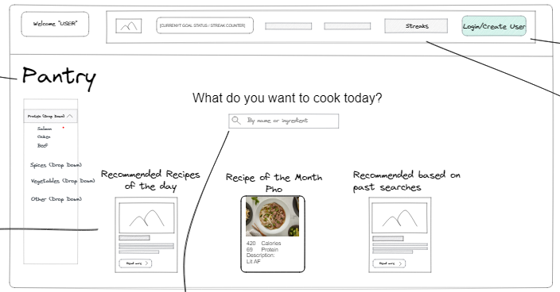
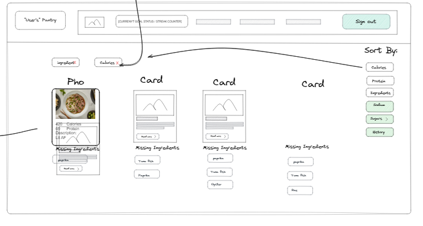
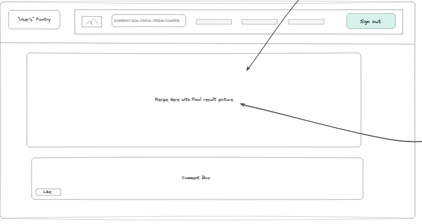
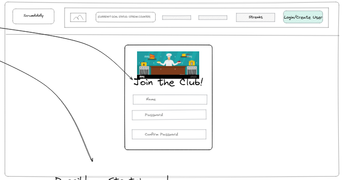
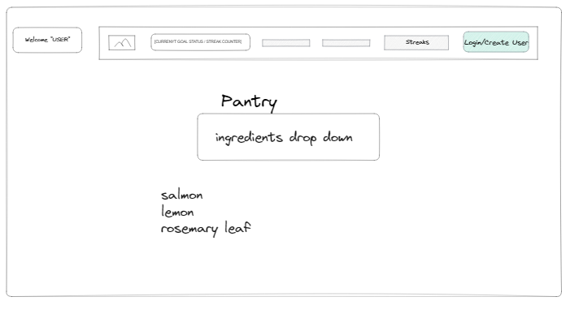

# User Graphical Human Interface

## Home Page

This will be the first page visitors arrive to on the website.
There will be links to the pantry and recipe list on this page.

## Recipe List

This page will be where the visitor browse all of the recipes in the database. Each recipe card will be a link to the recipe detail page.

## Recipe Detail Page

This page will be where the visitor look at the full detail view of a recipe including the type, region, instructions and ingredients.

## Login/Registration Form

This will be the form that the user will use to register or log in.

## Pantry Page

This is where users and browse and input or delete ingredients from their digital pantry.

